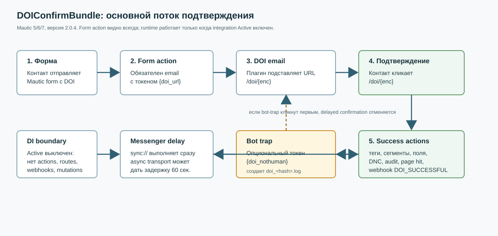
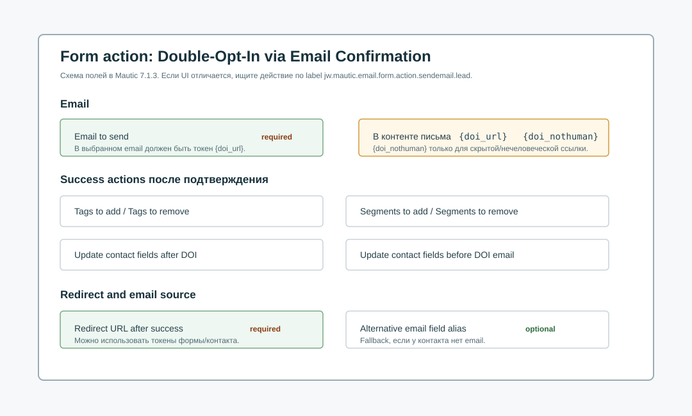

# DOIConfirmBundle 2.1.6: руководство оператора

Документ описывает canonical plugin source `DOIConfirmBundle` версии `2.1.6`
для Mautic 5.x, 6.x и 7.x, включая проверенный сценарий Mautic 7.1.3.
Live-установку, demo-цепочку и приемку на `news.show-master.ru` выполняет
SalesSnap-Operation. Этот репозиторий содержит только source, документацию и
plugin-owned compatibility evidence.



## Назначение

`DOIConfirmBundle` добавляет double opt-in процесс к обычной Mautic form.
Контакт отправляет форму, Mautic отправляет выбранное письмо с подтверждающей
ссылкой, а после клика плагин применяет настроенные действия: добавляет или
удаляет теги, добавляет или удаляет сегменты, обновляет поля контакта, снимает
email DNC, пишет audit log, регистрирует page hit и отправляет webhook event.
Опционально плагин может отправить выбранное письмо владельцу/пользователю
только после финального DOI-подтверждения.

Главный runtime-переключатель — `Active` у integration `Doi Report`. Когда
integration выключена, новая DOI-action не видна в `Add a new submit action`.
Если форма уже содержит DOI-action `jw.email.send.lead`, builder открывается
нормально: существующая action отображается как отключенная/сохраненная,
не выглядит исполняемой, не открывает controls редактирования/удаления и
сохраняет существующие properties при сохранении формы. При выключенной
integration плагин также не выполняет form submissions, не показывает
report/webhook события, не принимает public DOI endpoints и не применяет queued
mutations.

## Lifecycle

1. Оператор обновляет/refresh plugin, открывает `Plugins`, выбирает
   `DOI Confirm Bundle`, открывает `Doi Report` и включает integration.
2. Оператор создает или выбирает email для DOI.
3. В письме обязательно размещается token `{doi_url}`.
4. Опционально в скрытую или не предназначенную для человека ссылку добавляется
   token `{doi_nothuman}`.
5. В форме добавляется action `Double-Opt-In (DOI) via Email Confirmation`.
6. При submit action плагин собирает DOI payload, шифрует его и отправляет DOI
   email выбранному контакту.
7. Клик по `/doi/{enc}` расшифровывает payload, восстанавливает исходный request
   context и ставит success processing в Symfony Messenger.
8. Если transport `sync://`, success actions выполняются сразу. Если настроен
   async transport, обработка может быть отложена; в plugin code используется
   задержка 60 секунд.
9. Если до обработки был открыт `/nothuman/{hash}`, handler отменяет pending
   success actions и удаляет marker.
10. Если bot-trap не сработал, handler применяет DOI success actions.

## Form action в Mautic 7.1.3



В Mautic 7.1.3 ожидаемая последовательность настройки:

1. Откройте form.
2. Перейдите в tab или section `Actions`.
3. Добавьте submit action из группы email actions:
   `Double-Opt-In (DOI) via Email Confirmation`.
4. Заполните обязательные поля:
   `Email to send` и `Redirect URL after success`.
5. При необходимости заполните DOI state actions:
   `Tags to set after successfull DOI`,
   `Tags to remove after successfull DOI`,
   `Segments to add to contact after successfull DOI`,
   `Segments to remove from contact after successfull DOI`,
   `Update contact fields after successfull DOI`.
   Поля `Tags/Segments to remove after successfull DOI` также задают pending
   состояние: эти теги/сегменты добавляются сразу после успешной отправки
   формы и удаляются после DOI-click.
6. При необходимости заполните pre-send action:
   `Update contact fields before successfull DOI`.
7. Если email может быть сохранен не в основном поле контакта, заполните
   `Lead field alias for email (optional)`.
8. Если владельцу задания нужно письмо только после финального подтверждения,
   включите `Send owner email after DOI confirmation`. Пока галочка снята,
   DOI-action выглядит как в версии 2.0.x. После включения появляются только
   штатные поля Mautic из owner-email action: `Email to send`, кнопки
   New/Edit/Preview Email и `Send email to user`. Не добавляйте отдельную
   стандартную action отправки владельцу, если письмо не должно уходить до
   DOI-click. Основной DOI email block и owner email block рендерятся штатными
   Mautic email templates текущей версии Mautic, а не отдельной
   plugin-разметкой.

Если UI отличается от скриншотов или перевода, ориентируйтесь на source keys и
storage names:

| Назначение | UI label key | Storage key |
| --- | --- | --- |
| Выбор DOI email | `mautic.email.send.selectemails` | `email` |
| Redirect после подтверждения | `jw.mautic.form.action.redirect_url` | `post_url` |
| Добавить теги после успеха | `jw.mautic.lead.tags.add_campaign_doi_success_tags` | `add_campaign_doi_success_tags` |
| Удалить теги после успеха | `jw.remove_tags_doi_success_tags` | `remove_tags_doi_success_tags` |
| Добавить сегменты после успеха | `jw.add_campaign_doi_success_lists` | `add_campaign_doi_success_lists` |
| Удалить сегменты после успеха | `jw.remove_campaign_doi_success_lists` | `remove_campaign_doi_success_lists` |
| Обновить поля после успеха | `jw.mautic.form.action.lead_field_update` | `lead_field_update` |
| Обновить поля до отправки DOI email | `jw.mautic.form.action.lead_field_update_before` | `lead_field_update_before` |
| Альтернативное поле email | `jw.mautic.form.action.alternative_email_field` | `alternative_email_field` |
| Включить письмо владельцу после DOI | `jw.mautic.email.form.action.sendemail.owner.after_doi` | `send_owner_email` |
| Настройки письма владельцу после DOI | native Mautic email/user labels | `owner_email` |

## Tokens

`{doi_url}` обязателен. Он заменяется на absolute URL маршрута `/doi/{enc}`,
где `enc` содержит зашифрованный payload: contact id, redirect URL, hash,
form id и настроенные success actions.

`{doi_nothuman}` опционален. Он заменяется на absolute URL маршрута
`/nothuman/{hash}`. Этот URL нужен только для anti-scanner сценария: поместите
его в скрытую ссылку, пиксель/невидимый блок или другой элемент, по которому
обычный человек не должен кликать. Если security scanner откроет этот URL до
success processing, плагин создаст marker `doi_<hash>.log`, а handler отменит
подтверждение.

Не используйте `{doi_nothuman}` как видимую кнопку или ссылку подтверждения.
Видимая ссылка подтверждения всегда должна вести через `{doi_url}`.

## Confirmation flow

Public route `/doi/{enc}`:

1. Проверяет, что integration active.
2. Декодирует URL-safe base64.
3. Расшифровывает payload через Mautic `EncryptionHelper`.
4. Проверяет contact id и загружает contact.
5. Сохраняет request context: query, request body, cookies, URI и server headers.
6. Отправляет `DoiConfirmationMessage` в `messenger.default_bus` с задержкой
   60 секунд.
7. Если dispatch недоступен, применяет fallback processing сразу.
8. Redirect выполняется на `post_url`.

Public route `/nothuman/{hash}`:

1. Проверяет, что integration active.
2. Создает marker file `doi_<hash>.log` в Mautic cache path.
3. Возвращает template `@DOIConfirm/Doi/nothuman.html.twig`.

## Success actions

Handler `DoiConfirmationMessageHandler` перед применением действий проверяет
bot-trap marker. Если marker существует, он удаляется, а success actions не
выполняются.

Если marker отсутствует, `DoiActionHelper` выполняет:

1. Audit log с `bundle=lead`, `object=doi`, `action=confirm_doi`.
2. Добавление и удаление tags.
3. Добавление и удаление segments.
4. Обновление contact fields по строке вида `alias=value`.
5. Подстановку tokens `{doi_ip}`, `{doi_timestamp}`, `{tokenid}` в field update.
6. Снятие email DNC через `EmailModel::removeDoNotContact()`.
7. Contact identification event `LeadEvents::ON_CLICKTHROUGH_IDENTIFICATION`.
8. Page hit через `PageModel::hitPage()`.
9. Webhook event `doi.successful`.
10. Если включено `Send owner email after DOI confirmation`, отправляет
    выбранное owner/user письмо через штатный Mautic email action service.
    Ошибка этой отправки логируется warning и не откатывает уже примененные
    DOI success actions.

Начиная с версии `2.0.3`, исходный confirmation-click request временно возвращается в
Mautic `RequestStack` на время success actions. Это важно для Mautic 7.1.3:
`IpLookupHelper` и `PageModel` читают текущий request stack для IP, privacy
headers, bot detection и trackability checks. Без этого delayed CLI processing
мог уходить в fallback context `127.0.0.1`.

## Webhooks and report

Плагин добавляет webhook events:

| Event | Когда отправляется |
| --- | --- |
| `doi.started` | После запуска DOI process и отправки DOI email |
| `doi.successful` | После успешного подтверждения и применения success actions |

Report context `jw.doi` читает Mautic `audit_log` и показывает DOI audit rows.
Report и webhook builder также зависят от integration `Active`; при выключенной
integration они не регистрируются.

## Messenger delay

Mautic 5+ использует Symfony Messenger. По умолчанию transport часто настроен
как `sync://`, поэтому DOI success actions выполняются в том же web request.
Для защиты от link scanners настройте async transport для message class:

```text
MauticPlugin\DOIConfirmBundle\Message\DoiConfirmationMessage
```

После настройки async transport убедитесь, что worker запущен штатным способом
для конкретного Mautic instance. Это operational work и выполняется владельцем
instance, не plugin source task.

## Диагностика

Быстрые проверки без изменения Mautic core:

1. Убедиться, что plugin version в Mautic registry равен `2.1.6`.
2. Убедиться, что `/s/plugins/config/DoiReport` открывается не 404, а обычной
   страницей настройки integration.
3. Убедиться, что integration `Doi Report` active.
4. Проверить, что form action сохранен с ключом `jw.email.send.lead`.
5. Проверить, что выбранный email published и содержит `{doi_url}`.
6. Если используется scanner protection, проверить наличие `{doi_nothuman}` в
   скрытой/нечеловеческой ссылке, а не в видимой кнопке.
7. Проверить, что redirect URL в `post_url` абсолютный и валидный.
8. Проверить Mautic logs на diagnostic:
   `DOI runtime disabled: DoiReport integration settings are missing` или
   `DOI runtime disabled: DoiReport integration is not active`.
   Если в старом live state были две строки `DoiReport`, версия `2.0.12`
   должна оставить активную строку authoritative и заархивировать stale-дубли
   как `DoiReport.duplicate.<id>` без ручного SQL.
   Delayed confirmation в версии `2.0.12` добавляет in-memory session к
   synthetic request, поэтому `SessionNotFoundException` из
   `RequestStack::getSession()` в Mautic listeners не должен обрывать DOI flow.
   Если встречается warning
   `DOI confirmation page-hit tracking failed; confirmation actions will continue`,
   проверить остальные evidence: audit, контактные изменения, DNC, webhook и
   redirect должны завершиться несмотря на недоступный page-hit tracking.
9. Проверить `audit_log` для `bundle=lead`, `object=doi`,
   `action=confirm_doi`.
10. Проверить webhook queue/events для `doi.started` и `doi.successful`.
11. Проверить cache path на одиночные test markers `doi_<hash>.log`.
12. При `Doi Report Active=No` открыть новую форму или форму без DOI-action и
    убедиться, что DOI отсутствует в chooser `Add a new submit action`.
13. При `Doi Report Active=No` открыть форму с уже настроенной
    `jw.email.send.lead`, убедиться, что Mautic builder не падает, action
    показана как `Отключено`, не выглядит исполняемой, а сохранение формы без
    изменений не удаляет ее properties.
14. Проверить цикл `Active=No -> Active=Yes -> Active=No`: без reinstall и без
    потери настроек существующая DOI-action снова становится обычной при
    включении и снова preserved/disabled при выключении.
15. При выключенной галочке `Send owner email after DOI confirmation` убедиться,
    что дополнительные owner-email поля не отображаются.
16. При включенной галочке выбрать `Email to send` и пользователей в
    `Send email to user`, пройти DOI-flow и убедиться, что owner/user письмо
    отправлено только после финального клика по `{doi_url}`.

Safe cleanup для test DOI:

```sh
find var/cache -name 'doi_*.log' -type f -print
```

Удалять следует только конкретные test marker files, например:

```sh
rm var/cache/prod/doi_<hash>.log
```

Не удаляйте весь cache directory только ради DOI marker cleanup. Полный Mautic
cache rebuild — отдельная operational operation.

## Rollback

Rollback live instance выполняет SalesSnap-Operation штатным MCC/MCD путем.
Plugin source contract для rollback:

1. Предыдущий опубликованный tag: `v2.1.5`.
2. Текущий опубликованный tag: `v2.1.6`.
3. Bundle directory: `plugins/DOIConfirmBundle`.
4. Runtime state хранится в Mautic form action config, integration settings,
   contacts, DNC, audit log и webhook queue; plugin rollback не должен purge
   native settings без отдельного решения владельца instance.
5. После rollback нужно refresh/reload plugins и clear/warm cache штатным
   способом владельца instance.
6. Если async Messenger был настроен для `DoiConfirmationMessage`, worker и
   queue state проверяются отдельно владельцем instance.

## Проверка v2.1.6 для Mautic 6.x и 7.x

Проверка source выполнена для release `v2.1.6`:

- integration discovery aligned: `Integration/DoiReportIntegration.php`,
  service id `mautic.integration.doireport`, object name `DoiReport`;
- duplicate exact-name `DoiReport` rows normalized deterministically: active
  row wins over stale disabled row, stale duplicate is archived in place;
- delayed synthetic-request page-hit tracking failure is non-fatal: audit,
  contact mutations, DNC removal and webhook dispatch continue;
- delayed synthetic requests provide in-memory session access to listeners that
  call `RequestStack::getSession()`;
- synchronous page-hit tracking still calls `PageModel::hitPage()` when
  available;
- оба email-блока рендерятся одним штатным Mautic
  `emailsend_list_row`, а unchecked owner-блок получает `hidden`,
  `display:none` и прямой checkbox toggle; внешние gutters обоих штатных
  email-блоков нормализованы, а primary/owner sections один раз уменьшаются на
  общий 30px Mautic gutter до ширины обычных полей action;
- Russian (`ru`, `ru_RU`) and Serbian (`sr_RS`) catalogs contain the same 21
  message keys as `en_US` without known English fallback UI labels;
- initial submit applies pending DOI tags/segments from the existing
  remove-after-success settings, while confirmation removes pending state and
  applies confirmed tags/segments idempotently;
- pending tag/segment assignment before DOI email is best-effort; a warning is
  logged if it fails, and email dispatch continues;
- optional owner/user email settings are hidden while unchecked and render only
  native Mautic email/user fields when enabled;
- primary DOI email select/buttons and owner/user email select/buttons reuse
  the current Mautic email selector Twig blocks;
- primary DOI email fields are built by Mautic's native `EmailSendType`, not by
  plugin-copied button definitions;
- owner/user notification dispatch runs after final DOI confirmation and is
  skipped when the checkbox is not enabled;
- expected Plugins UI config route: `/s/plugins/config/DoiReport`;
- public routes остались `/doi/{enc}` и `/nothuman/{hash}`;
- tokens остались `{doi_url}` и `{doi_nothuman}`;
- form action context остался `jw.email.send.lead`;
- success actions, DNC removal, audit log and webhooks сохранили прежние
  storage keys and event names;
- Mautic 7.1.3 source API проверен для `RequestStack` usage в
  `IpLookupHelper`, `PageModel::hitPage()`, `EmailModel::sendEmail()` и
  `EmailModel::removeDoNotContact()`;
- expanded runtime service/form check был выполнен на локальном Mautic 7.x
  install и инстанцировал controller, listeners, handler, helpers, integration
  и form type.
- inactive empty-form path скрывает `jw.email.send.lead` из add-action registry;
- inactive existing-action path регистрирует disabled placeholder только для
  форм, где `jw.email.send.lead` уже сохранен в builder session или storage;
- disabled existing-action template убирает DOI option из chooser,
  показывает disabled status и не выводит edit/delete controls;
- локальный runtime compatibility check пройден на Mautic `7.2.0` и `6.0.0`
  с новым service wiring `request_stack` + `doctrine.orm.entity_manager`.

Ограничение evidence: live delivery, live webhook receiver, live queue worker и
customer-host installation не выполнялись в plugin source task.
